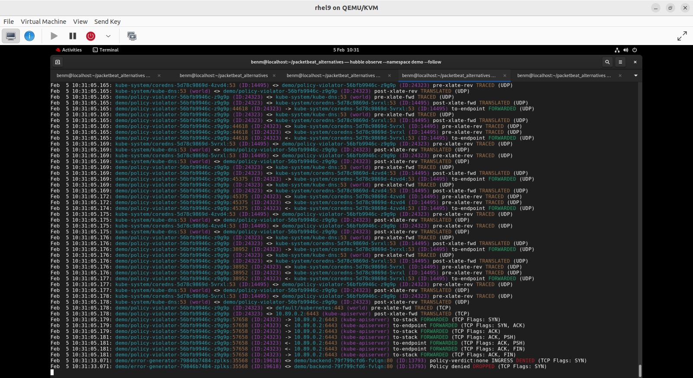

# Cilium vs Packetbeat POC - RHEL9 + Podman

Packetbeat being designed around Elastic ingest is quite verbose (approx 2-5k of metadata per event) vs Cilium's 200-500 bytes. This repo contains everything needed to run a side-by-side comparison of Cilium/Hubble and Packetbeat on RHEL9 using Podman.

[A summary of specific error scenarios tested with cilium output for granularity inspection (the steps for which are provided below)](testing/POC-Live-Preview.md)

[Cilium vs Packetbeat results from local RHEL9 demo machine](./reports/comparison-report-20260203-114043.txt)

[Cilium vs Packetbeat sample test data (first 5000 captured events) can be found in the data-sample folder along with a companion README linked to here](./data-sample/README.md)



## Contents

```
cilium-packetbeat-poc/
├── README.md                    # This file
├── TEST-RESULTS-SUMMARY.md      # Latest test results and findings
├── create-sample-data.sh        # Create sample data for Git upload
├── prepare-upload.sh            # Prepare test data for repository upload
├── analyze-collected-data.sh    # Analyze collected test data
├── setup/
│   ├── 00-prerequisites.sh      # System prerequisites setup
│   ├── 01-install-tools.sh      # Install Kind, kubectl, Cilium CLI, Hubble CLI
│   ├── 02-create-cluster-rootful.sh # Create Kind cluster with Podman
│   └── 03-verify-setup.sh       # Verify installation
├── deploy/
│   ├── kind-config.yaml         # Kind cluster configuration
│   ├── cilium-install.sh        # Install Cilium + Hubble
│   ├── packetbeat-config.yaml   # Packetbeat ConfigMap
│   ├── packetbeat-daemonset.yaml # Packetbeat deployment
│   └── test-app.yaml            # Demo microservices application
├── testing/
│   ├── deploy-error-scenarios.sh    # Deploy all error test scenarios
│   ├── enable-l7-visibility.sh      # Enable L7 HTTP visibility for Cilium
│   ├── verify-l7-visibility.sh      # Verify L7 is working
│   ├── analyze-error-scenarios.sh   # Analyze error scenario results
│   ├── error-generator.yaml         # Continuous error generation
│   ├── backend-error-service.yaml   # Backend that returns specific status codes
│   ├── network-policy-tests.yaml    # Network policies for testing
│   ├── policy-violator.yaml         # Attempts policy violations
│   ├── ERROR-SCENARIOS-README.md    # Detailed error testing guide
│   ├── generate-traffic.sh          # Generate test traffic (original)
│   └── test-scenarios.sh            # Run specific test scenarios
├── collection/
│   ├── collect-hubble-data.sh   # Collect Hubble flows and metrics
│   ├── collect-packetbeat-data.sh # Collect Packetbeat captures
│   └── export-all.sh            # Export all data
├── analysis/
│   ├── generate-report.sh       # Generate comparison report
│   ├── compare-data.sh          # Compare data volume and coverage
│   ├── analyze-protocols.sh     # Protocol coverage analysis
│   └── resource-usage.sh        # Resource consumption comparison
└── cleanup/
    ├── cleanup-all.sh           # Remove everything
    └── cleanup-data-only.sh     # Keep cluster, remove data
```

## Quick Start

### 1. Prerequisites Setup (one-time)
```bash
cd cilium-packetbeat-poc
chmod +x setup/*.sh
sudo ./setup/00-prerequisites.sh
# System will reboot after this step
```

After reboot:
```bash
cd cilium-packetbeat-poc
./setup/01-install-tools.sh
./setup/02-create-cluster-rootful.sh
```

### 2. Deploy Monitoring Stack
```bash
chmod +x deploy/*.sh
./deploy/cilium-install.sh
kubectl apply -f deploy/packetbeat-daemonset.yaml
kubectl apply -f deploy/packetbeat-config.yaml
kubectl apply -f deploy/test-app.yaml

# Enable Hubble port-forwarding (required for CLI access)
cilium hubble port-forward &
```

### 3. Generate Traffic
```bash
chmod +x testing/*.sh
./testing/generate-traffic.sh
```

### 4. Collect Data (after 1-24 hours)
```bash
chmod +x collection/*.sh
./collection/export-all.sh
```

### 5. Analyze Results
```bash
chmod +x analysis/*.sh
./analysis/generate-report.sh
```

### 6. Share Your Results (Optional)

```bash
# First, analyze what data you collected
./analyze-collected-data.sh

# Create a Git-friendly sample dataset (first 1000 events from each file)
# Typical size: ~10-20 MB (safe for Git)
./create-sample-data.sh 1000

# OR: Create summary package with reports and stats only (no raw data)
# Typical size: < 10 MB (includes reports, statistics, sample data)
./prepare-upload.sh

# Then commit to Git
git add data-sample/  # if using create-sample-data.sh
# OR
git add upload-package-*/  # if using prepare-upload.sh

git commit -m "Add test results: 230x storage difference (Hubble 17MB vs Packetbeat 3.9GB)"
git push
```

See [Sharing and Uploading Test Data](#sharing-and-uploading-test-data) section below for details.

## Manual Steps

### Access Hubble UI
```bash
cilium hubble ui
# Opens browser at http://localhost:12000
```

### View Live Hubble Flows
```bash
# First, ensure Hubble port-forwarding is active
cilium hubble port-forward &

# Then observe flows
hubble observe --namespace demo

# Filter by specific criteria
hubble observe --namespace demo --protocol http
hubble observe --namespace demo --verdict DROPPED
```

### View Packetbeat Logs
```bash
kubectl logs -n monitoring -l app=packetbeat -f
```

### Check Resource Usage
```bash
# View pod resource consumption
kubectl top pods --all-namespaces

# Check Cilium status
cilium status

# Check Packetbeat status
kubectl get pods -n monitoring
```

## Testing network and protocol error scenarios

[An additional set of test scripts and config are provided here](/testing/ERROR-SCENARIOS-README.md) for testing specific error scenarios (useful for understanding the level of granularity captured by Cilium).

## Troubleshooting

### If Kind fails to start
Check cgroup version:
```bash
podman info | grep -i cgroup
```
Should show `cgroupVersion: v2`

### If Hubble doesn't start
```bash
cilium status
cilium hubble enable --ui
```

### If Hubble observe fails with "connection refused"
Start the port-forward:
```bash
cilium hubble port-forward &

# Or manually:
kubectl port-forward -n kube-system svc/hubble-relay 4245:4245 &
```

### If Packetbeat pods are stuck
```bash
kubectl describe pod -n monitoring -l app=packetbeat
```

### If cluster creation fails with delegation error
Try using rootful Podman (which you should already be doing):
```bash
./setup/02-create-cluster-rootful.sh
```

Or see `DELEGATION-TROUBLESHOOTING.md` for detailed solutions.

## Data Collection Timeline

- **15 minutes**: Initial validation data
- **1 hour**: Short-term comparison
- **24 hours**: Full production-like comparison (recommended)

## Sharing and Uploading Test Data

### Latest Test Results

**February 5, 2026 Test Run:**
- **Hubble:** 12,232 flows, 17 MB total
- **Packetbeat:** 970,539 events, 3.9 GB total
- **Storage Ratio:** 230:1 (Packetbeat captures 230x more data)
- **Full Results:** See [TEST-RESULTS-SUMMARY.md](TEST-RESULTS-SUMMARY.md)

### Step 1: Analyze Your Collected Data

After running `./collection/export-all.sh`, analyze what you collected:

```bash
# Quick analysis of your data
./analyze-collected-data.sh
```

This shows:
- Total data size
- Number of Hubble flows captured
- Number of Packetbeat events captured
- Recommended upload strategy based on size

### Step 2: Create Sample Data for Git

Full test data (typically 100 MB - 4 GB) is too large for Git. Create a sample dataset:

```bash
# Create sample with first 1000 events per file (default)
# This creates ~10-20 MB of data - perfect for Git
./create-sample-data.sh 1000

# For smaller repos, use fewer events
# Creates ~5-10 MB - good for quick demos
./create-sample-data.sh 500

# For more comprehensive samples, use more events
# Creates ~50-100 MB - still Git-friendly but shows more patterns
./create-sample-data.sh 5000
```

This creates `data-sample/` directory with:
- First N events from each data file (Hubble flows and Packetbeat events)
- All statistics and metadata (already small files)
- Auto-generated README with usage examples and analysis commands

**Example: With 1000 events from your 4 GB dataset:**
- Hubble sample: ~1.4 MB (1000 flows from 12,232 total)
- Packetbeat sample: ~4 MB (1000 events from 970,539 total)
- Total sample size: ~10-15 MB

**Upload sample to Git:**
```bash
git add data-sample/
git commit -m "Add sample test data (1000 events per file)"
git push origin your-branch
```

### Step 3: Prepare Summary Package (Optional)

For a complete summary package with reports and statistics but WITHOUT raw event data:

```bash
# Create comprehensive summary package for Git upload
# This includes: reports, statistics, sample data, metadata
# Does NOT include: full 4 GB raw data files
# Typical size: < 10 MB (much smaller than create-sample-data.sh)
./prepare-upload.sh
```

**What this creates:**
1. `upload-package-YYYYMMDD-HHMMSS/` - Git-ready summary package containing:
   - All analysis reports from `reports/`
   - Statistics files (hubble-stats.txt, packetbeat-stats.txt)
   - Sample data (first 1000 events)
   - Metrics and cluster info
   - Auto-generated README

2. `test-results-YYYYMMDD-HHMMSS.tar.gz` - Compressed summary (~5-10 MB)
   - For easy sharing via email or Slack

3. `full-test-data-YYYYMMDD-HHMMSS.tar.gz` - Complete raw data (~1-2 GB compressed)
   - For GitHub Release or external storage
   - Contains all 12,232 Hubble flows and 970,539 Packetbeat events

**Upload summary package to Git:**
```bash
# Upload only the summary (< 10 MB)
git add upload-package-*/
git commit -m "Add test results summary: Hubble 17MB vs Packetbeat 3.9GB"
git push origin your-branch
```

**For full data, use GitHub Release or external storage (not Git):**
- The full-test-data archive is too large for Git
- See Step 4 below for sharing options

### Step 4: Share Full Data (If Needed)

For complete datasets (100 MB - 4 GB):

**Option A: GitHub Release**
1. Go to: https://github.com/your-username/your-repo/releases
2. Create new release
3. Upload `full-test-data-*.tar.gz` (supports up to 2 GB)

**Option B: External Storage**
- Google Drive, Dropbox, or AWS S3
- Upload `full-test-data-*.tar.gz`
- Add link to repository

See [UPLOAD-DATA-GUIDE.md](UPLOAD-DATA-GUIDE.md) for detailed upload strategies.

## Expected Outputs

After running `./collection/export-all.sh`:
- `data/hubble-flows.json` - Hubble flow data
- `data/hubble-metrics.txt` - Prometheus metrics
- `data/packetbeat-data/` - Packetbeat capture files
- `data/resource-usage.json` - CPU/Memory usage

After running `./analysis/generate-report.sh`:
- `reports/comparison-report.txt` - Summary report
- `reports/protocol-coverage.txt` - Protocol analysis
- `reports/resource-usage.txt` - Resource comparison

## What Gets Compared

The POC compares Cilium/Hubble vs Packetbeat on:

1. **Data Volume & Efficiency**
   - Storage requirements
   - JSON verbosity and redundancy
   - Compression ratios

2. **Protocol Coverage**
   - HTTP/HTTPS requests, methods, status codes
   - DNS queries and responses
   - TCP/UDP flows and connection states
   - TLS/SSL certificate information
   - Database protocols (MySQL, PostgreSQL, Redis)

3. **Network Visibility**
   - Connection tracking
   - Failed/dropped connections with reasons
   - Policy enforcement visibility
   - Service-to-service communication

4. **Kubernetes Context**
   - **Hubble**: Pod names, labels, namespace context
   - **Packetbeat**: IP addresses, ports, packet details

5. **Resource Overhead**
   - CPU and memory consumption
   - Network overhead from monitoring
   - Scalability implications

6. **Operational Considerations**
   - Query performance
   - Integration options (Elastic Stack vs Prometheus/Grafana)
   - Ease of troubleshooting

## Key Differences You'll Observe

| Aspect | Packetbeat | Cilium/Hubble |
|--------|------------|---------------|
| **Granularity** | Packet-level (very detailed) | Flow-level (aggregated) |
| **Context** | IP addresses, ports | Pod names, Kubernetes labels |
| **Data Volume** | High (verbose JSON) | Lower (efficient) |
| **Redundancy** | High (metadata repeated per event) | Low (normalized) |
| **Use Case** | Deep packet inspection, forensics | Kubernetes-native monitoring |
| **Overhead** | Higher CPU/memory | Lower CPU/memory |
| **Integration** | Elastic Stack | Prometheus, Grafana |

## Cleanup

Keep cluster, remove data:
```bash
./cleanup/cleanup-data-only.sh
```

Remove everything:
```bash
./cleanup/cleanup-all.sh
```

## Support

For issues specific to:
- **Kind + Podman**: https://kind.sigs.k8s.io/docs/user/rootless/
- **Cilium**: https://docs.cilium.io/
- **Packetbeat**: https://www.elastic.co/guide/en/beats/packetbeat/

## Notes

- This POC runs entirely on your laptop using Podman
- No cloud resources or external dependencies required
- All data stays local
- Safe to run on development machines
- Rootful Podman is used to avoid systemd delegation issues
- Traffic generators create realistic HTTP, DNS, and failed connection patterns
- Both monitoring tools capture the same traffic simultaneously for accurate comparison
